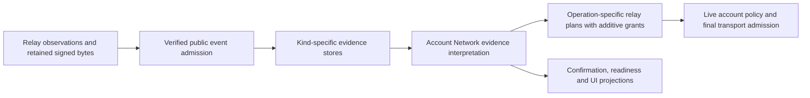

# Account Network evidence and relay authority

This implementation note complements [Relay Settings Boundaries](relay-settings-boundaries.md).
It describes the shared owners that keep signed preferences, observations,
runtime routing, and transport admission separate.

## Data flow

`verified-public-event.ts` owns immutable public-event admission. Admission
proves signed bytes and authorship. It does not prove freshness, completeness,
route eligibility, publication, or delivery. Restored bytes pass through that
same owner; verification outages never turn retained bytes into invalid events.

`account-network-mutation.ts` remains the sole NIP-65/NIP-17 mutation owner.
It reviews, signs, stages, distributes, and retries exact events. The media
preference writer retains its separate BUD-03 ordering and storage contract.

## Shared evidence interpretation

`account-network-evidence.ts` owns these pure decisions:

- `compareAccountNetworkRevisions`: greater `created_at`, then lowest event id.
- `interpretAccountNetworkRead`: admitted scope and per-source complete,
  partial, authentication-required, timeout, verification-unavailable,
  unavailable, policy-blocked, or cancelled observations.
- `mergeAccountNetworkLookup`: monotonic observation time and conservative
  equal-time concurrency. Re-observation does not invent complete coverage.
- `interpretAccountNetworkPreference`: current signed state, pending
  distribution, retained usable state, staleness, and scoped absence.
- `classifyAccountNetworkReadback` and `summarizeAccountNetworkReadback`:
  exact signed observation with relay provenance, conclusive scoped absence,
  and unresolved observations. ACK is not exact readback.
- `interpretAccountNetworkInboxRecovery`: actual persisted cutover batches,
  awaiting confirmation versus a running grace period, and expiry.

Owner relay-list, inbox, and media modules supply kind-specific parsed records
to those decisions. Their repositories still own atomic persistence and
causal transitions. A newer signed-empty or malformed media frontier retains
its exact signed event so restoration cannot resurrect an older server choice.

A valid current inbox remains routing authority while its distribution is
pending. Retained last-usable evidence is not automatically historical recovery.
Views project `currentUsable` separately from observation coverage and freshness.
Workflow continuation, including returning to a saved product draft, consumes
that prepared authority fact rather than requiring complete readback or lookup.
Only a staged replacement creates a recovery transition; its grace clock starts
under the existing exact confirmation contract. Read failure cannot start it.

Scoped absence requires a completed admitted bounded query with no matching
event and no stronger usable retained or pending frontier. It is never proof
of global absence. Authentication-required and verification-unavailable reads
remain distinguishable even when anonymous readback cannot complete.

Protected message-history completeness comes from the selected sources' bounded
history observations and admitted wraps. Declaration lookup freshness does not
negate a completed history read under surviving signed current authority.
Listing-deletion checks retain their NIP-09 author/target validation while
carrying the public read plan through the deletion query's final I/O gate.

## Independent grants

`relay-authority.ts` defines `RelayTarget { url, grants }`. Each small grant
names one applicable authority and operation. `mergeRelayTargets` deduplicates
URLs while retaining every independent grant. Plans may expose URL arrays for
ordering, progress, or diagnostics; those arrays do not authorize account I/O.

| Authority                            | Operation policy                                     | Local layer switch                        |
| ------------------------------------ | ---------------------------------------------------- | ----------------------------------------- |
| App role / named public fallback     | General, commerce, search, or protected-default role | App                                       |
| Owner signed NIP-65                  | Owner Read or Publish role                           | Personal NIP-65                           |
| Owner signed NIP-17                  | Current inbox read / owner self-copy                 | Neither                                   |
| Recipient signed NIP-17              | Exclusive recipient delivery                         | Neither                                   |
| Owner staged selection               | Exact signed preference distribution/readback        | Neither; exact event revalidated          |
| Historical recovery / retained inbox | Named owner read plan                                | Neither; evidence revalidated             |
| Declaration discovery registry       | Bounded discovery and preference distribution        | Neither                                   |
| Named compatibility                  | Existing bounded inbox-read or validated-order lane  | Order writes require App and rollout flag |
| Remote NIP-65 / public hint          | Named public read or public-event routing            | Neither; secure remote transport only     |
| Source delivery                      | Exact public deletion propagation to prior sources   | Neither; secure transport only            |

One URL can have several grants. Disabling one layer removes that grant only.
A current owner inbox is independent of the personal NIP-65 switch. A remote
hint cannot inherit owner transport permission from URL equality.

The authenticated owner may explicitly select `ws://` for their own activity.
The final gate checks the matching account, applicable admitted signed owner
selection, current local policy, and exclusions. Remote declarations,
provenance, fallback configuration, and another account cannot grant it.

## Defaults and local switches

`config.ts` remains the versioned registry owner. Its App read, write,
commerce, and private-inbox roles have distinct operation policies. Core public
fallback, commerce discovery, search/index, DM declaration discovery, commerce
DM fallback, default encrypted inbox candidates, and validated-order
compatibility retain their named buckets. Environment values augment only the
named bucket they configure. Bucket overlap does not imply signed membership.

Only App `nip65Preset` and `nip17Preset` fields seed the reviewed "Match Conduit
defaults" recommendation. After signing, those choices have owner authority
and no dependency on the App switch.

`account-network-routing-policy.ts` alone reconciles local switches. App starts
enabled. Untouched personal routing stays enabled while discovery is unknown,
partial, or unavailable, and while usable current, retained, or pending NIP-65
evidence exists. Only complete scoped absence can initialize it disabled.
An explicit user touch remains authoritative during later reconciliation.

## Operation and execution owners

| Boundary                                                                                 | Responsibility / consumers                                                                                                                   |
| ---------------------------------------------------------------------------------------- | -------------------------------------------------------------------------------------------------------------------------------------------- |
| `relay-planner.ts`                                                                       | Public/general, commerce, author reads and public-event writes; profiles, products, follows, shipping, shopper evidence, Event Market        |
| `planPublicEventReadbackTargets`                                                         | Exact public-event confirmation after ACK; derives read grants from the authorized public write plan, never from private recipient authority |
| `owner-relay-list-evidence.ts`                                                           | Bounded NIP-65 discovery and validated owner supplemental reads                                                                              |
| `private-message-routing.ts`                                                             | Declaration discovery, current/retained/recovery inbox plans, exclusive recipient and bounded compatibility delivery                         |
| `media-server-preferences.ts`                                                            | Media preference read/write/readback plans; image upload consumes prepared preference use                                                    |
| `network-preferences.ts`                                                                 | Hydration/reconciliation, signed role projection, inspection targets                                                                         |
| `account-network-local-state.ts`                                                         | `filterEligibleAccountRelayTargets`: live grant composition, layer switches, causal whole-relay exclusions, final owner transport authority  |
| `relay-reader.ts`, `relay-publish.ts`                                                    | Recheck prepared targets immediately before final account I/O; preserve detailed transport observations and exact signed bytes               |
| `protected-inbox-read.ts`, `protected-inbox-history.ts`, `relay-executor.ts`             | Recipient filter binding, authenticated transport, pagination, live account/session admission                                                |
| `private-message-delivery.ts`, `order-relay-delivery.ts`, `product-deletion-delivery.ts` | Immutable domain-specific retry targets, current signed authority intersection, grant propagation                                            |
| Shared hooks, `network-settings-view.ts`, shared UI and app readiness consumers          | Consume prepared evidence, readiness, and plan results; no transport-to-protocol inference                                                   |

Shared Account Network startup reconciliation deliberately uses reproducible
bounded registry discovery, separate from owner-local distribution. Direct
authenticated discovery can supplement with validated owner NIP-65 sources.
Both paths report their actual scope.

Profile search carries `RelayTarget[]` through its dependency seam to the reader.
URL lists at that seam describe ordering and counts; the fetch consumer does not
re-read settings or infer grants from a matching App or owner URL.

Historical exact-delivery records can lack newer declaration IDs or layer flags.
Their validated saved targets bound candidate grants. Final admission still
requires current signed recipient or owner authority, or an applicable current
App role, and applies the same switches and exclusions. Missing historical
metadata cannot grant a new target or transport permission.

Persisted layer flags describe original plan provenance. They do not veto an
independent authority proved later at the same saved author-write target. Such
targets compose App and owner write candidates before shared final admission;
source-only targets keep their separate secure public-source policy.

Content-free delivery diagnostics omit executable grants and retain only their
existing URL/status summary. Execution keeps the authority context internally;
diagnostic output cannot be reused as an authorized plan.

## Intentional separate concerns

- Anonymous public reads and exact public writes may accept secure URLs at
  their transport adapter. They cannot exercise owner-only transport authority.
  Account-scoped paths require prepared grants and live exclusions.
- NIP-11/capability scans, relay health, ranking, and equivalent local ordering
  are observations or preferences, not signed membership. An explicitly entered
  diagnostic target authorizes only that bounded diagnostic operation.
- BUD-03 HTTPS server policy and upload authorization remain independent of
  relay authority. Unverified display records cannot authorize an upload.
- Product/deletion, payment receipt, shipping, and Event Market evidence retain
  their own domain validation. Their relay adapters consume shared plans.
- Signer connection relays, NWC provider relays, public zap-service transport,
  and explicit isolated test transport have their own scoped authority. They
  do not become Account Network membership or inbox fallback.
- Analytics vocabulary retains old readiness values for historical events.
  The repair observer also records pending distribution as a distribution
  outcome. Neither determines protocol authority or routing readiness.
- Merchant setup checklists consume the prepared saved/pending role projection
  to describe configured Publish preferences. They do not prove transport
  availability or authorize relay I/O or payment execution.

The contract tests cover source uncertainty, signed frontiers, equal-time
concurrency, switch reconciliation, overlapping grants, exact retries, signed
defaults, pending/retained restoration, and owner transport isolation. Browser
tests exercise shared startup, refresh, local persistence, pending retry, and
media editing. Live external signers and paid protected-relay interoperability
still require maintainer validation; anonymous auth-required evidence alone
does not establish a provider defect.
